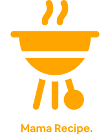

<div id="top"></div>
<!-- PROJECT LOGO -->
<br />
<div align="center">
  <a href="https://github.com/edoprayoga1999/foodrecipe-fe/">
    
  </a>

  <h3 align="center">FoodRecipe - App</h3>

  <p align="center">
    Share your awesome recipe here!
    <br />
    <a href="https://github.com/edoprayoga1999/foodrecipe-fe/"><strong>Explore the docs »</strong></a>
    <br />
    <br />
    <a href="https://foodrecipe-mama.netlify.app/">View Demo</a>
    ·
    <a href="https://github.com/edoprayoga1999/foodrecipe-fe/issues">Report Bug</a>
    ·
    <a href="https://github.com/edoprayoga1999/foodrecipe-fe/issues">Request Feature</a>
    <br />
    <p align="center">
    <a href="https://reactjs.org/"></a>
    <a href="https://axios-http.com/"></a>
    <a href="https://redux.js.org/"></a>
    <a href="https://getbootstrap.com/"></a>
    
    </p>
  </p>
</div>

<!-- TABLE OF CONTENTS -->

<details>
  <summary>Table of Contents</summary>
  <ol>
    <li>
      <a href="#about-the-project">About The Project</a>
      <ul>
        <li><a href="#built-with">Built With</a></li>
      </ul>
    </li>
    <li>
      <a href="#getting-started">Getting Started</a>
      <ul>
        <li><a href="#prerequisites">Prerequisites</a></li>
        <li><a href="#installation">Installation</a></li>
      </ul>
    </li>
    <li><a href="#usage">Usage</a></li>
    <li><a href="#roadmap">Roadmap</a></li>
    <li><a href="#contributing">Contributing</a></li>
    <li><a href="#license">License</a></li>
    <li><a href="#contact">Contact</a></li>
    <li><a href="#acknowledgments">Acknowledgments</a></li>
  </ol>
</details>


<!-- ABOUT THE PROJECT -->
## About The Project

Food Recipe - App is a food recipe application that aims to share recipes with fellow users. Users can see each other's recipes that are shared with each other, add, modify, and delete recipes that they have added.

<p align="right">(<a href="#top">back to top</a>)</p>


### Built With

This application is built with the following technologies:

* [Javascript](https://www.javascript.com/)
* [CSS](https://developer.mozilla.org/id/docs/Web/CSS)
* [React.js](https://reactjs.org/)
* [Axios](https://axios-http.com)
* [Redux](https://axios-http.com)
* [Bootstrap](https://getbootstrap.com)

<p align="right">(<a href="#top">back to top</a>)</p>


<!-- GETTING STARTED -->
## Getting Started

To set up this project locally and get a local copy up, follow thes simple steps.

### Prerequisites

Things that you need to run this application
* Node.js
  
### Installation

1. Clone this front-end repository
   ```sh
   git clone https://github.com/edoprayoga1999/foodrecipe-fe.git
   ```
2. Go to repo local folder
   ```sh
   cd foodrecipe-fe
   ```
3. Install NPM packages
   ```sh
   npm install
   ```
4. Setup your env , based on env.example
   ```
   REACT_APP_BACKEND_URL= 
   ```
5. Run your app
   ```
   npm run start
   ```
<p align="right">(<a href="#top">back to top</a>)</p>


## Usage

Use this space to show useful examples of how a project can be used. Additional screenshots, code examples and demos work well in this space. You may also link to more resources.

_For more examples, please refer to the [Documentation](https://example.com)_

<p align="right">(<a href="#top">back to top</a>)</p>

## Screenshot


<!-- CONTRIBUTING -->
## Contributing

Contributions are what make the open source community such an amazing place to learn, inspire, and create. Any contributions you make are **greatly appreciated**.

If you have a suggestion that would make this better, please fork the repo and create a pull request. You can also simply open an issue with the tag "enhancement".
Don't forget to give the project a star! Thanks again!

1. Fork the Project
2. Create your Feature Branch (`git checkout -b feature/AmazingFeature`)
3. Commit your Changes (`git commit -m 'Add some AmazingFeature'`)
4. Push to the Branch (`git push origin feature/AmazingFeature`)
5. Open a Pull Request

<p align="right">(<a href="#top">back to top</a>)</p>


<!-- LICENSE -->
## License

Distributed under the MIT License. See `LICENSE.txt` for more information.

<p align="right">(<a href="#top">back to top</a>)</p>

## Related Sroject

:rocket: [`FoodRecipe Backend`](https://github.com/edoprayoga1999/FoodRecipe-App-Backend)

<!-- CONTACT -->
## Contact

Edo Prayoga - [fb.me/edoprayoga1999](https://facebook.com/edoprayoga1999) - edoprayoga.se@gmail.com

Project Link: [https://github.com/edoprayoga1999/foodrecipe-fe](https://github.com/edoprayoga1999/foodrecipe-fe)

<p align="right">(<a href="#top">back to top</a>)</p>
